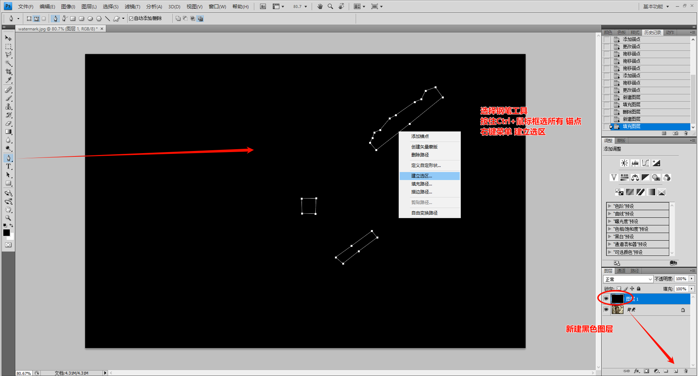
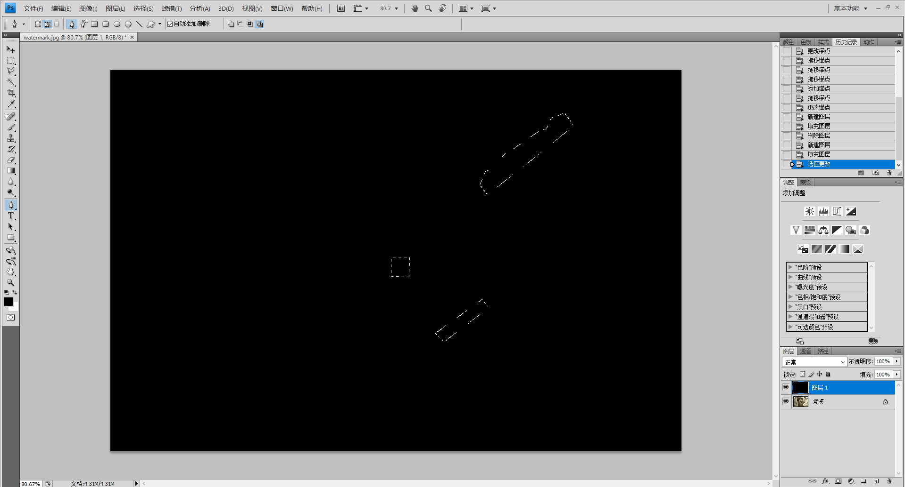
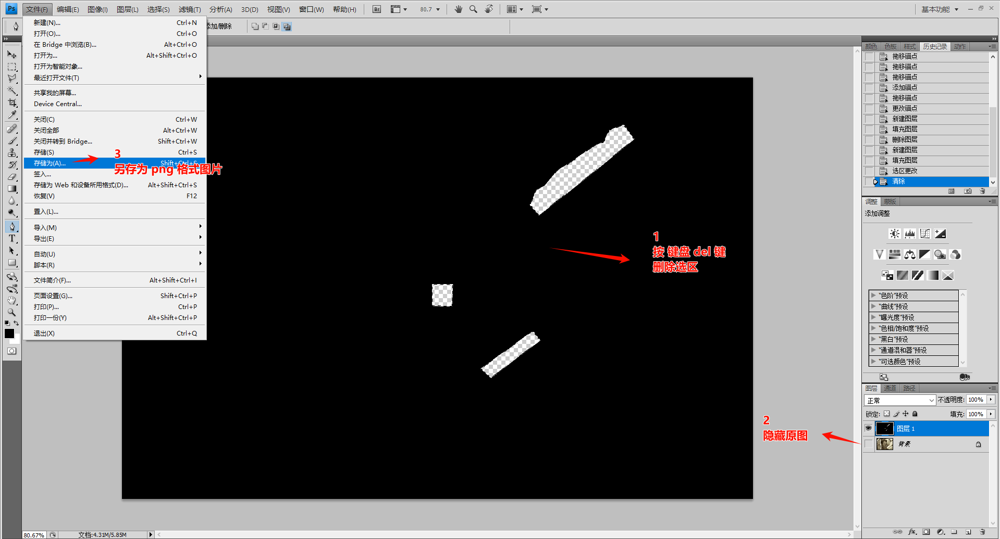
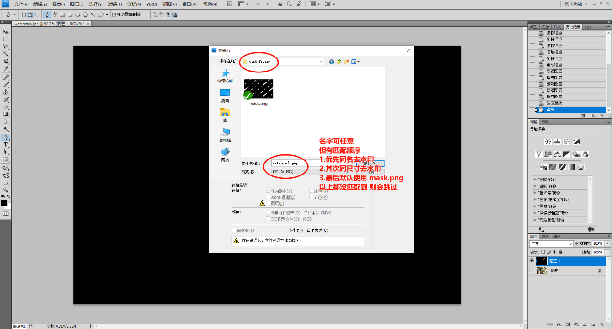

# x-inpaint
> Batch processing for image inpainting.


> [IOPaint](https://github.com/Sanster/IOPaint)
> Here is the source code, which extracts the code for batch repairing images for secondary development.

## Usage

- image_folder
  + `the image that needs to be inpaint`

- mask_folder
  + `mask image`

- output_dir
  + `inpaint image`


## Development

```bash
pip install -r requirements.txt

# python main.py run --model=lama --device=cpu --image=image_folder --mask=mask_folder/mask.png --output=output_dir
python main.py
```

## Generate exe

```bash
pyinstaller --onefile main.py
```


## 使用指南

0. image_folder 中的 watermark.jpg


1. 导入 Photoshop 制作mask遮罩图


2. 建立选区

- 复杂水印 建议使用钢笔工具
- 如果是简单的水印，可以尝试使用矩形工具 或 其它选区工具



3. 钢笔路径 生成的选区



4. 制作mask遮罩图
- 新建黑色图层
- 将路径生成选区
- 按del删除选区 得到遮罩
- 隐藏原图
- 存储为（保存图片）



5. 保存png遮罩图
- 名字可任意，但有匹配顺序
  + 优先同名去水印
  + 其次同尺寸去水印
  + 最后默认使用mask.png
  + 以上都没匹配到则会跳过



6. 最终png格式遮罩图
- mask遮罩图 制作的越精细，擦除效果越好
- 相同水印位置+相同尺寸图片，可重复使用遮罩
- 遮罩图越复杂，需要的擦除的时间就越久


7. 运行程序准备
- image_folder 原图放这里，可多个，需要与mask_folder对应
- mask_folder 遮罩图放这里，可多个，需要与image_folder对应
- output_dir 输出目录

